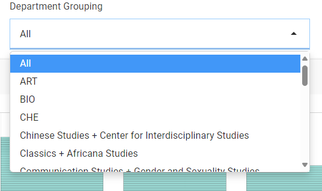
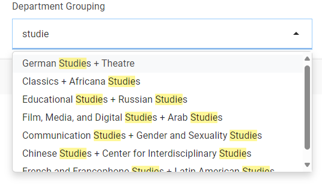
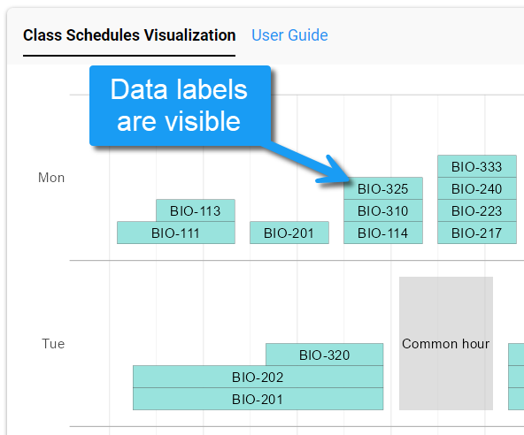
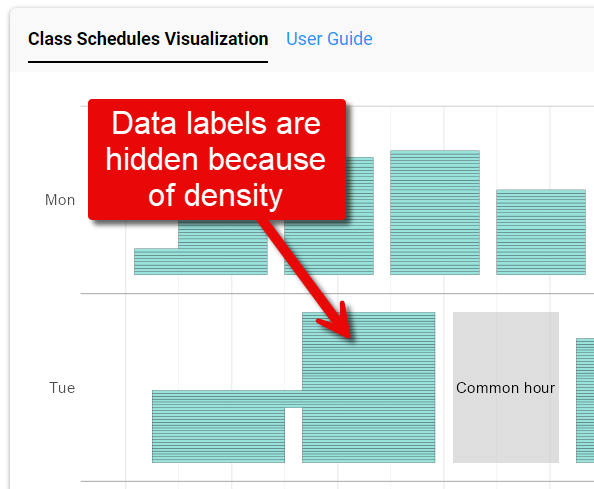

### Table of Contents

1.  [How to use this dashboard](#howto)
2.  [Refreshing departments](#refresh)
3.  [Frequently Asked Questions (FAQ)](#faq)
4.  [About](#about)

### How to use this dashboard {#howto}

The CatSched Dashboard is meant to help faculty (particularly department chairs) 
balance their proposed class schedules for the upcoming term by providing a 
graphical representation of the data they have entered in the CatSched app.

First, start by selecting a department grouping from the searchable drop-down 
menu at the top of the dashboard. All entries are organized alphabetically, and 
there is an option to view all departments at the top of the list. Larger 
departments are left as stand-alone entries in this list, but smaller ones are 
grouped together to facilitate planning between their respective department 
chairs.

{fig-alt="Screenshot showing available options in the department grouping drop-down menu"}

You can also perform a keyword search in this menu by deleting any text from the 
box and typing in a value you want to search for, such as "Studies."

{fig-alt="Screenshot showing keyword search for \"Studies\""}

After making a selection, you can view the results on the tab labeled "Class 
Schedules Visualization." This shows the graphical representation of the class 
schedule, with days of the week arranged in order along the Y axis, and hours of 
each day arranged along the X axis, starting at 8:00 AM and ending at 4:30 PM.

{width="767"}

The visual displays the combined subject code and course number (e.g., "CSC-110") 
in each meeting time. However, if the data in the visual becomes too dense, the 
dashboard is programmed to hide these labels. For instance, if you select either 
the "All" option from the drop-down menu, or you select a grouping with an 
usually large number of concurrent classes happening, these labels will 
disappear from the visual.

{width="481"}

{width="486"}

------------------------------------------------------------------------

### Refreshing departments {#refresh}

The list of departments that you find in the "Department Grouping" menu can be 
refreshed by clicking the button in the upper-right corner of the dashboard. 
This button reloads the app and issues a new call to the CatSched API to populate 
the menu.

------------------------------------------------------------------------

### Frequently Asked Questions {#faq}

#### How fresh is the data in this dashboard?

The dashboard should always reflect the latest data from CatSched. It achieves 
this by performing a synchronous API call whenever you change the department in 
the drop-down menu.

#### Why can't I see individual sections?

Sections of the same course often meet at the same time in the same location for 
lectures (e.g., BIO-111) before splitting off into smaller lab groups. To avoid 
cluttering the dashboard with redundant information, these sections were rolled 
up at the course level by de-duplicating the data by subject code, course number, 
and meeting times.

```         
┌──────────────────────────┐                                          
│       BIO-111-A          │                                          
│                          ┼──────────┐                               
│     MWF 0830-0920        │          │                               
└──────────────────────────┘          │                               
                                      ▼                               
┌──────────────────────────┐          ┌──────────────────────────────┐
│       BIO-111-B          │          │            BIO-111           │
│                          ┼─────────►│         (all sections)       │
│     MWF 0830-0920        │          │          MWF 0830-0920       │
└──────────────────────────┘          └──────────────────────────────┘
                                      ▲                               
┌──────────────────────────┐          │                               
│       BIO-111-C          │          │                               
│                          ┼──────────┘                               
│     MWF 0830-0920        │                                          
└──────────────────────────┘                                          
```

------------------------------------------------------------------------

### About {#about}

This dashboard was developed in R Shiny by the Data Science faculty in partnership with the Registrar's office.

-   If you have questions or suggestions about the dashboard, please email pebenbow\@davidson.edu.

-   If you have questions about classes or the CatSched app, please email registrar\@davidson.edu.

{width="600"}
